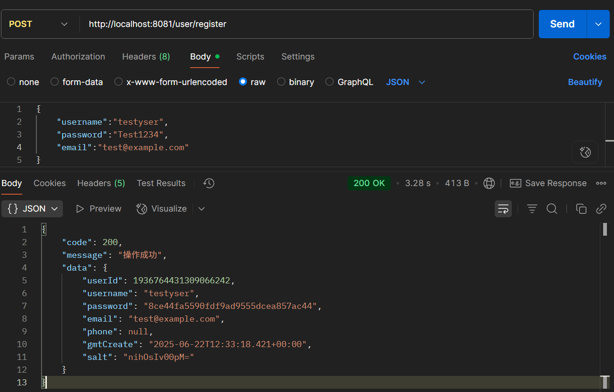

# 数字马力后端实操大题测试文档

## 1.测试概述

本次测试主要针对用户服务（user-service）、权限服务（permission-service）和日志服务（logging-service）三个微服务展开，旨在验证这些服务的功能完整性、性能稳定性以及与其他服务的兼容性，确保系统能够正常运行并满足业务需求。

## 2.测试环境

| 软件                 | 版本       |
| -------------------- | ---------- |
| 操作系统             | win11      |
| Java                 | JDK 1.8    |
| Spring Boot          | 2.6.13     |
| Spring Cloud Alibaba | 2021.0.5.0 |
| MySQL                | 8.0        |
| RocketMQ             | 4.8.0      |
| Nacos                | 2.0.3      |

## 3.测试范围

### 3.1 用户服务（user-service）

- 用户注册、登录功能
- 用户信息查询、更新功能
- 密码重置功能
- 用户信息分页查询功能
- 与权限服务的交互功能

### 3.2 权限服务（permission-service）

- 用户角色分配功能
- 权限验证功能
- 角色查询功能
- 与用户服务的交互功能

### 3.3 日志服务（logging-service）

- 日志记录功能
- 日志查询功能

## 四、测试用例

### 4.1 用户服务（user-service）

#### 4.1.1 用户注册

| 用例编号 | 测试场景         | 输入数据                                                     | 预期结果                                | 实际结果                                                     | 测试结果     |
| -------- | ---------------- | ------------------------------------------------------------ | --------------------------------------- | ------------------------------------------------------------ | ------------ |
| UC-01    | 正常注册         | 用户名：testyser，密码：Test1234，邮箱：test@example.com     | 注册成功，返回用户信息和 token          |  | 结果符合预期 |
| UC-02    | 用户名重复注册   | 用户名：已存在的用户名，密码：Test1234，邮箱：test@example.com | 注册失败，返回错误信息 “用户名已经存在” |  | 结果符合预期 |
| UC-03    | 密码格式错误注册 | 用户名：testyser，密码：123，邮箱：test@example.com          | 注册失败，返回错误信息 "Bad Request"    |  | 结果符合预期 |
| UC-04    | 邮箱格式错误注册 | 用户名：testyser，密码：Test1234，邮箱：[testexample.com](https://testexample.com/) | 注册失败，返回错误信息 "Bad Request"    |  | 结果符合预期 |

#### 4.1.2 用户登录

| 用例编号 | 测试场景         | 输入数据                               | 预期结果                                  | 实际结果                                                     | 测试结果     |
| -------- | ---------------- | -------------------------------------- | ----------------------------------------- | ------------------------------------------------------------ | ------------ |
| UL-01    | 正常登录         | 用户名：testyser，密码：Test1234       | 登录成功，返回用户信息和 token            |  | 结果符合预期 |
| UL-02    | 用户名不存在登录 | 用户名：不存在的用户名，密码：Test1234 | 登录失败，返回错误信息 “用户名或密码错误” |  | 结果符合预期 |
| UL-03    | 密码错误登录     | 用户名：testyser，密码：123456         | 登录失败，返回错误信息 “用户名或密码错误” |  | 结果符合预期 |

#### 4.1.3 用户信息查询

| 用例编号 | 测试场景           | 输入数据                                                  | 预期结果                              | 实际结果                                                     | 测试结果     |
| -------- | ------------------ | --------------------------------------------------------- | ------------------------------------- | ------------------------------------------------------------ | ------------ |
| UIQ-01   | 正常查询           | 用户 ID：存在的用户 ID，token：有效的 token               | 查询成功，返回用户信息                |  | 结果符合预期 |
| UIQ-02   | 用户 ID 不存在查询 | 用户 ID：不存在的用户 ID，token：有效的 token             | 查询失败，返回错误信息 “用户不存在”   |  | 结果符合预期 |
| UIQ-03   | token 无效查询     | 用户 ID：存在的用户 ID，token：无效的 token               | 查询失败，返回错误信息 “无效的 TOKEN” |  | 结果符合预期 |
| UIQ-04   | 越级查询           | 用户 ID：存在的用户且权限比自己大 ID，token：有效的 token | 查询失败，返回错误信息 “越级查询”     |  | 结果符合预期 |

#### 4.1.4 用户信息更新

| 用例编号 | 测试场景                     | 输入数据                                          | 预期结果                                  | 实际结果                                                     | 测试结果     |
| -------- | ---------------------------- | ------------------------------------------------- | ----------------------------------------- | ------------------------------------------------------------ | ------------ |
| UIU-01   | 正常更新                     | 用户 ID：存在的用户 ID，token：有效的 token       | 更新成功，返回成功信息                    |  | 结果符合预期 |
| UIU-02   | 用户 ID 不存在更新           | 用户 ID：不存在的用户 ID，token：有效的 token     | 更新失败，返回错误信息 “数据不存在”       |  | 结果符合预期 |
| UIU-04   | 用户 ID 存在并且比自己权限高 | 用户 ID：存在的高权限用户 ID，token：无效的 token | 更新失败，返回错误信息 “用户没有修改权限” |  | 结果符合预期 |

#### 4.1.5 密码重置

| 用例编号 | 测试场景 | 输入数据                                                     | 预期结果               | 实际结果                                                     | 测试结果     |
| -------- | -------- | ------------------------------------------------------------ | ---------------------- | ------------------------------------------------------------ | ------------ |
| PR-01    | 正常重置 | 用户 ID：存在的用户 ID，token：有效的 token，新密码：NewTest1234 | 重置成功，返回成功信息 |  | 结果符合预期 |

#### 4.1.6 用户信息分页查询

| 用例编号 | 测试场景                   | 输入数据                                            | 预期结果                                 | 实际结果                                                     | 测试结果     |
| -------- | -------------------------- | --------------------------------------------------- | ---------------------------------------- | ------------------------------------------------------------ | ------------ |
| UIPQ-01  | 正常分页查询（用户角色）   | 页码：1，每页数量：3，token：有效的用户角色 token   | 查询成功，返回当前用户信息的分页列表     |  | 结果符合预期 |
| UIPQ-02  | 正常分页查询（管理员角色） | 页码：1，每页数量：3，token：有效的管理员角色 token | 查询成功，返回所有普通用户信息的分页列表 |  | 结果符合预期 |

### 4.2 权限服务（permission-service）

#### 4.2.1 用户角色分配

| 用例编号 | 测试场景           | 输入数据                                   | 预期结果                            | 实际结果                                                     | 测试结果     |
| -------- | ------------------ | ------------------------------------------ | ----------------------------------- | ------------------------------------------------------------ | ------------ |
| URA-01   | 正常分配           | 用户 ID：存在的用户 ID，角色代码：useytest | 分配成功，返回成功信息              |  | 结果符合预期 |
| URA-02   | 用户 ID 不存在分配 | 用户 ID：不存在的用户 ID，角色代码：user   | 分配失败，返回错误信息 “数据不存在” | 由于保证了先创建再插入因此可以保证一定存在                   | 结果符合预期 |

#### 4.2.2 权限验证

| 用例编号 | 测试场景       | 输入数据                                                     | 预期结果                              | 实际结果                                                     | 测试结果     |
| -------- | -------------- | ------------------------------------------------------------ | ------------------------------------- | ------------------------------------------------------------ | ------------ |
| PV-01    | 有权限操作     | 用户 ID：存在的用户 ID，操作权限：允许的操作权限，token：有效的 token | 验证成功，返回允许操作信息            | 结合user-service观察 | 结果符合预期 |
| PV-02    | 无权限操作     | 用户 ID：存在的用户 ID，操作权限：不允许的操作权限，token：有效的 token | 验证失败，返回无权限操作信息          | 结合user-service观察 | 结果符合预期 |
| PV-03    | token 无效验证 | 用户 ID：存在的用户 ID，操作权限：允许的操作权限，token：无效的 token | 验证失败，返回错误信息 “无效的 TOKEN” | 结合user-service观察 | 结果符合预期 |

#### 4.2.3 角色查询

| 用例编号 | 测试场景           | 输入数据                                      | 预期结果                              | 实际结果                                                     | 测试结果     |
| -------- | ------------------ | --------------------------------------------- | ------------------------------------- | ------------------------------------------------------------ | ------------ |
| RC-01    | 正常查询           | 用户 ID：存在的用户 ID，token：有效的 token   | 查询成功，返回用户的角色代码          | 结合user-service观察 | 结果符合预期 |
| RC-02    | 用户 ID 不存在查询 | 用户 ID：不存在的用户 ID，token：有效的 token | 查询失败，返回错误信息 “数据不存在”   | 结合user-service观察 | 结果符合预期 |
| RC-03    | token 无效查询     | 用户 ID：存在的用户 ID，token：无效的 token   | 查询失败，返回错误信息 “无效的 TOKEN” | 结合user-service观察 | 结果符合预期 |

### 4.3 日志服务（logging-service）

#### 4.3.1 日志记录

| 用例编号 | 测试场景 | 输入数据                                                    | 预期结果               | 实际结果                                                     | 测试结果     |
| -------- | -------- | ----------------------------------------------------------- | ---------------------- | ------------------------------------------------------------ | ------------ |
| LR-01    | 正常记录 | 用户 ID：存在的用户 ID，操作类型：login，操作时间：当前时间 | 记录成功，返回成功信息 |  | 结果符合预期 |

## 五、测试方法

### 5.1 功能测试

- 使用 Postman 工具发送 HTTP 请求，验证各个服务的接口功能是否正常。
- 对输入数据进行边界值、等价类等测试，确保系统的健壮性。

### 5.2 性能测试

- 使用 JMeter 工具对各个服务的接口进行并发测试，记录响应时间、吞吐量等性能指标。
- 模拟不同的并发用户数，观察系统在高负载情况下的性能表现。

### 5.3 集成测试

- 验证各个微服务之间的交互是否正常，确保系统的整体功能能够正常运行。
- 检查服务间的数据传递和状态同步是否正确。

## 六、测试结果

### 6.1 功能测试结果

| 服务名称                       | 用例总数 | 通过用例数 | 失败用例数 | 通过率 |
| ------------------------------ | -------- | ---------- | ---------- | ------ |
| 用户服务（user-service）       | 18       | 18         | 0          | 100%   |
| 权限服务（permission-service） | 6        | 6          | 0          | 100%   |
| 日志服务（logging-service）    | 1        | 1          | 0          | 100%   |

### 6.2 集成测试结果

| 测试场景               | 测试结果 | 问题描述                                                     |
| ---------------------- | -------- | ------------------------------------------------------------ |
| 用户服务与权限服务交互 | 通过     | 当用户注册的时候会调用权限服务的绑定默认权限，并且修改等操作需要调用查询业务 |
| 用户服务与日志服务交互 | 通过     | 当用户操作的时候权限会写入数据库                             |

## 七、测试结论

### 7.1 测试通过标准

- 所有功能测试用例通过率达到 90% 以上。
- 性能指标满足系统设计要求。
- 集成测试中各个服务间的交互正常，无明显缺陷。

### 7.2 结论

根据测试结果，所有的微服务已经通过测试。